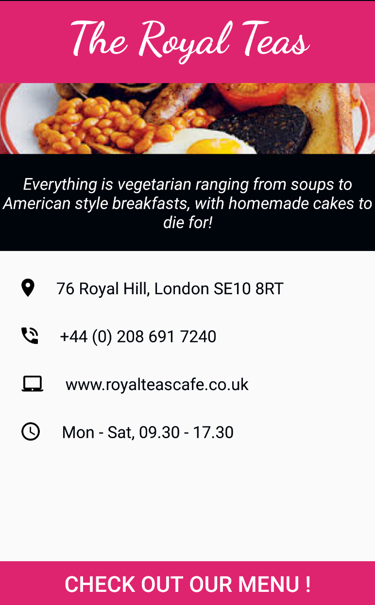

# ABND | Build a Single Screen App

This is the first part of the Android Basics Nanodegree program offered by Udacity in collaborating with Google.

# Project Description:
Design and implement a simple app that displays information about a small business.
 

# Learning outcomes:

•	Setup Android Studio  
•	Understand basic app structure  
•	Identify and apprecite the difference between different view types  
•	Perform simple manipulations on the Views  
•	Basic app troubleshooting  
